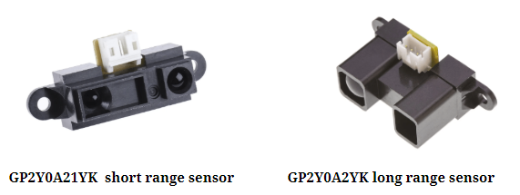
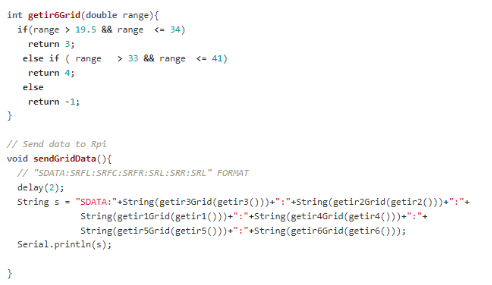

# Maze-Solving-Robot (Hardware)

The goal of this project is to develop a robot that can nevigate a grid maze.
The whole project can be split into 4 parts :
1. Algorithm
2. Communication (Rpi)
3. Movement (Arduino)
4. Interface (Android)

My responsiblity for this project is to ensure the robot performs precisive movements to avoid near by obstacles,
by detecting nearby objects using different IR sensors, which is based on Arduino.  
Thus, this page will just be focus on the matters regarding to Arduino.

## Requirments:
1. The robot must be able to perform accurate straight line, turnings and calibrations to explore the 200cm X 150cm X 15cm arena with obstacles placed in different locations within the arena.
2. Obstacles in the arena must be detected and avoided with 6 calibrated infra-red sensors.

## Implementation:
**1. Sensors overview** 
 
Usage : 5x short range sensors, 1x long range sensor

They are known as A0,A1,A2,A3,A4 for the short-range sensor and A5 for the long-range sensor. The IR sensors projects and receive infrared light in order to calculate the distance between the sensor and the object. This will be very useful during the exploration of the arena.

**2. Sensor Linearization** 
The formula  d= (1/(a*ADC+b))-k was used to calculate the distance from the analog reading of each sensor

d = distance
a =linear member of the trend line equation
b = free member of the trend line equation
ADC = the analog reading from the sensor
k = corrective constant that is used to straighten the trend line

In order to find the trend line equation for each sensor, the analog reading and distance were taken between 10 < 35 cm with an interval of 5cm for the short ranged sensor and 20 to 80 cm with an interval of 5 cm for the long ranged sensor. By experimenting, the value for k to form a linear line was found for each individual sensor, trend line equation is then calculated. The following images shows the graph where x-axis represents the analog reading and y-axis represents 1/R, where R is the range for each interval.
 
Each individual sensors is now calibrated with the equations above. Each function will turn the distance between the object and the sensor. 
 

**3. Sampling and sending data** 
As samples may fluctuate and generate spikes in the graphs, the sensors will make multiple measurements and take the median as the working value. As the measurements are not static in time,we require the median of a last defined period, a sort of Running median.

Running median library is used here for individual sensor to capture a sample size of 19 and extract the median.

The two main advantages of using the median above average is that it is not influenced by a single outlier and it always represent a real measurement, also, noted that offsets are implemented to fine tune the exact distance,resulting in maximum precision.

Accurate sensor values will be converted to grid value by functions , allowing the algorithm to locate how many blocks alway are the obstacles.
e.g 1 = 10 cm, 2 = 20 cm, 3 = 30 cm, 4 = 40 cm
sendGridData function will then concatenate all the grid values before sending out. Format is as follows : "SDATA:SRFL:SRFC:SRFR:SRL:SRR:SRL"  
 

With multiple layers of calibration, sampling and fine tuning, Arduino is now able to pass out necessary sensor data in a most precise manner.
