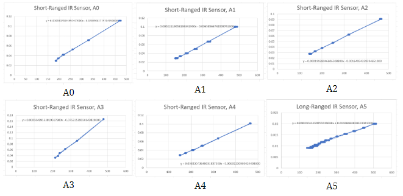
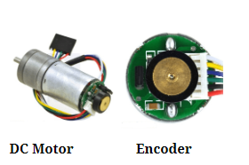
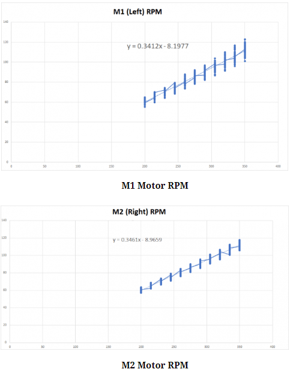
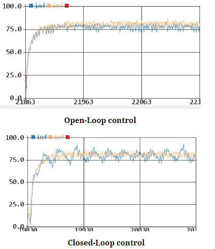

# Maze-Solving-Robot (Hardware)

The goal of this project is to develop a robot that can nevigate a grid maze.
The whole project can be split into 4 parts :
1. Algorithm
2. Communication (Rpi)
3. Movement (Arduino)
4. Interface (Android)

My responsiblity for this project is to ensure the robot performs precisive movements to avoid near by obstacles,
by detecting nearby objects using different IR sensors, which is based on Arduino.  
Thus, this page will just be focus on the matters regarding to Arduino.

## Requirments:
1. The robot must be able to perform accurate straight line, turnings and calibrations to explore the 200cm X 150cm X 15cm arena with obstacles placed in different locations within the arena.
2. Obstacles in the arena must be detected and avoided with 6 calibrated infra-red sensors.

## Implementation:
**1. Sensors overview** 
 
Usage : 5x short range sensors, 1x long range sensor

They are known as A0,A1,A2,A3,A4 for the short-range sensor and A5 for the long-range sensor. The IR sensors projects and receive infrared light in order to calculate the distance between the sensor and the object. This will be very useful during the exploration of the arena.

**2. Sensor Linearization** 
The formula  d= (1/(a*ADC+b))-k was used to calculate the distance from the analog reading of each sensor

d = distance
a =linear member of the trend line equation
b = free member of the trend line equation
ADC = the analog reading from the sensor
k = corrective constant that is used to straighten the trend line

In order to find the trend line equation for each sensor, the analog reading and distance were taken between 10 < 35 cm with an interval of 5cm for the short ranged sensor and 20 to 80 cm with an interval of 5 cm for the long ranged sensor. By experimenting, the value for k to form a linear line was found for each individual sensor, trend line equation is then calculated. The following images shows the graph where x-axis represents the analog reading and y-axis represents 1/R, where R is the range for each interval.
 
Each individual sensors is now calibrated with the equations above. Each function will turn the distance between the object and the sensor. 
 

**3. Sampling and sending data** 
As samples may fluctuate and generate spikes in the graphs, the sensors will make multiple measurements and take the median as the working value. As the measurements are not static in time,we require the median of a last defined period, a sort of Running median.

Running median library is used here for individual sensor to capture a sample size of 19 and extract the median.

The two main advantages of using the median above average is that it is not influenced by a single outlier and it always represent a real measurement, also, noted that offsets are implemented to fine tune the exact distance,resulting in maximum precision.

Accurate sensor values will be converted to grid value by functions , allowing the algorithm to locate how many blocks alway are the obstacles.
e.g 1 = 10 cm, 2 = 20 cm, 3 = 30 cm, 4 = 40 cm
sendGridData function will then concatenate all the grid values before sending out. Format is as follows : "SDATA:SRFL:SRFC:SRFR:SRL:SRR:SRL"  
 

With multiple layers of calibration, sampling and fine tuning, Arduino is now able to pass out necessary sensor data in a most precise manner. 
**1. Motor Control**  
The term DORA is the robot name 
 
Ensuring Dora can move in a accurate manner is crucial in this project, as it is the fundamental movements for exploration and fastest path. However,as each individual motors are unique and behaves differently, there’s a high possibility that one motor would be faster than the other. In our case, M1 left is faster than M2 right, this would cause Dora to be unable to move in a straight line and would lean towards the right side. Thus, motor control system must be implemented to guarantee accuracy movements.

**2. PWM matching (Open-loop system)** 
Initially PWM matching method is used to match both of the wheel speed.  We’ve taken a sample size of 100 for M1 & M2 rpm at the speed starting from 200 to 350 at an interval of 15. After which forming a linear relation for both M1 & M2 as shown in the graph below. 
 

Using the linear equation obtained above, the required PWM(X) value be calculated by entering a desired RPM(Y).

However, it has a limitation. This relationship is only applicable to the speed from 200 to 350 rather than covering any possible speed,further more it might not be accurate due to the fact that linearization doesn’t cover every point in the line and will also be affected by outliers.

With above reasons we decided to use a Closed-Loop System (PID) to ensure maximum accuracy.

**3. PID control (Close-Loop system)** 
The Closed-Loop System (PID) calculates the error (difference) between M1 and M2 adds the difference to M2 every 5 milliseconds so that both M1 & M2 are moving at the same speed. This is possible by utilizing the feedback from the encoder. 
 
The term PID consists 3 terms:

**Proportional term  (Kp)**
Produces an output value that is proportional to the current error value. A higher P value will result in a large change in the output value, therefor if  P is too large, the system might be unstable. 
**Integral term (Ki)**
The integral term accelerates the movement of the process towards set point and eliminates the residual steady-state error that occurs with a pure proportional controller. 
**Derivative term(Kd)**
Derivative action predicts system behavior and thus improves settling time and stability of the system.
For our bot Dora, kp = 18, ki = 8, kd = 0 are used for the final PID values after multiple experiments, which gives us the most accurate movements. 

**4. Comparison and conclusion** 
Below shows 2 graph of rpm vs time.  Blue line represents slower right wheel and Orange line represents faster left wheel. 
 

The main target of using closed loop control is to match the wheel speed, allowing Dora to move in a straight line or turn in a certain angle pressingly.

Note that the main focus between this 2 graphs is how the right wheel (Blue line) in the closed loop control graph is trying to match up the speed of the left wheel (Orange line). Slight fluctuations can be ignore here because print functions are used within the PID functions to produce these graphs, causing delays and uncertainties.

In comparison, the advantage of close loop control allows the wheels to be synchronized at any time and any speed possible, resulting in more stable and reliable movements, which is our ultimate goal for motor control.

The last factor we have to consider for the motor control is the battery voltage as it actually makes a huge difference at different voltage stages.

**6V Battery**

Different voltage will result in different performance as it determines the power the wheels will be provided. After continuous testing we found out that the optimal voltage for Dora is between 6.1 – 6.2 volts. Too much or too less will cause noticeable over/under turns.
